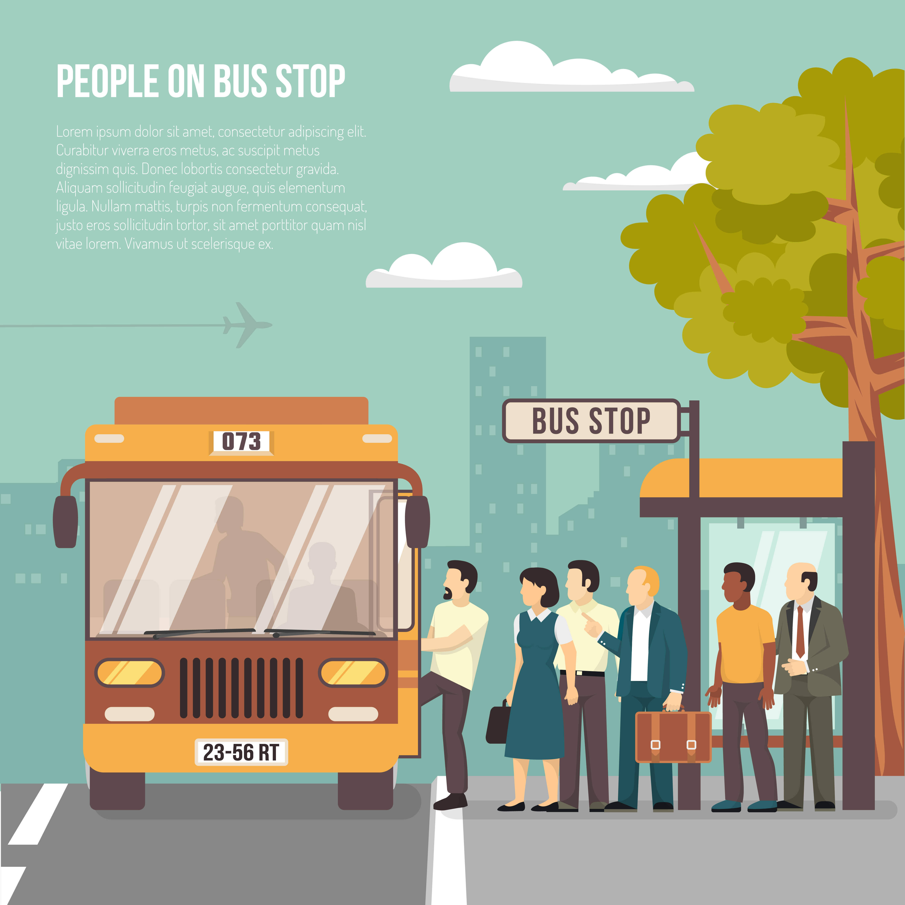
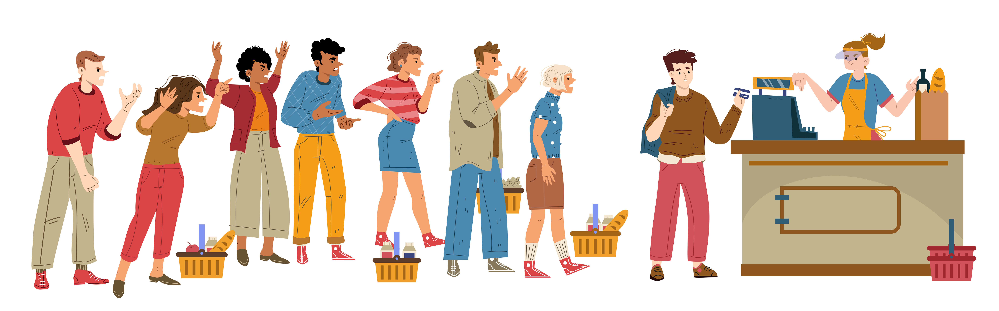

# **Queues**  
1. [Bus Station Que](#bus-station-que)  
2. [Grocery Store Que](#grocery-store-que)  
3. [Queue](#queues-1)

# Characteristics  
Queues are a data structure that follows the **(FIFO)** first in first out approach in prioritising excutiong of request or commands.
  
  
# Bus Station Que

  

Imagine you are on your way to work and you use public transport .Each morning a local bus company supplies buses that you give money and they carry you to your desired destination. You arrive at your closest bus stop and the queue has 40 people in front of you. Each bus carries 15 passengers which means when the next bus comes you will still be left with 25 people in front of you before you can board a bus.
1.	Each time a passengers gets on a bus we subtract 1 person from the line (dequeue)
2.	Each time a person join the queue at the back we add 1 more person to the queue.(enqueue)

# Grocery Store Que  

Each month at least once a month I go to the grocery store to get some supplies for my houses hold. Normally there is more people in the grocery store also buying supplies for their own households .As an end result the cashier serves whomever that comes first this is the FIFO method. To keep track of who goes next as customer we form a queue one after the other with the first ones in front of this queue .
1.	Dequeue when a cashier helps the client infront of the que
2.	Enqueue eaech time a person joins the que at the back.  

In Python we can implement this data structure through the use if in build python functions.
- To perform dequeue => pop(0) remove the an item on the specified location  
- To perform enqueue => append() add an item to the queue at the back 
- To assess the length => len() check the size of the queue

		
        -----------------------------------
        |Operation|Python Code|Performance|
        |---------|:---------:|----------:|
        | enqueue |  append() | O(1)      |
        | dequeue |  pop(0)   |   O(n)    |
        | length  |  len()    |    O(1)   | 
        -----------------------------------
            
# Queues  
Below is an example of Queue data structure in action.Imagine a bus arrives on a bus station .
1. Consider who goes first and who goes second?  
2. Consider who goes last   
The answers to the questions above is Queues in action.  
     Que       
                        
                      1           14
                [ ]  <==============  
                [ ]    
                [ ]   
                [ ]    
                [ ]    
                [ ] =>Bus

# **Key Words**
-	**Dequeue**-The operation of removing an item at the front of the queue
-	**Enqueue**-The operation of adding an item at the back of the queue
-	**Front**-Refers to the location in a queue where dequeue occurs
-	**Back**- Refers to the location in a queue where enqueue occurs
-	**Queue** –refere to a data structure that follows the FIFO operation 

